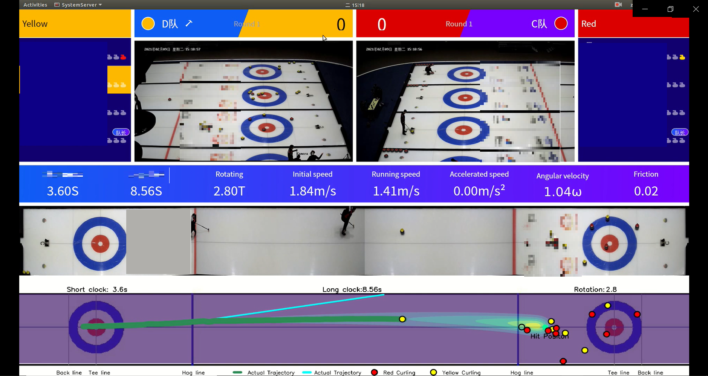

# CurlingCode
This project is used to provide visualization parameters along with video in real time during curling training. We display the trajectory, speed and other parameters in real time on the main interface.

<!--  -->
-------------
### Features：
#### Visualization:
- Real-time situation of the track. (corrected and stitched from four cameras)
- Simulation result of curling trajectory.
- Heat map which stand for the friction of the surface.
- Different technical parameters.

Real-time display and data presentation on the IPAD.
#### Technical parameters:

Following technical parameters can be calculated from our algorithm. 
- trajectory
- different evaluations of time
- initial velocity and real-time velocity
- acceleration
- friction
- aim line
- rotations
- angular velocity
- positions
- distance from certain positions
- ......

